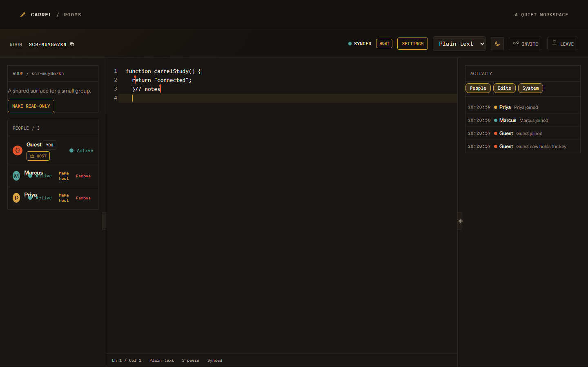
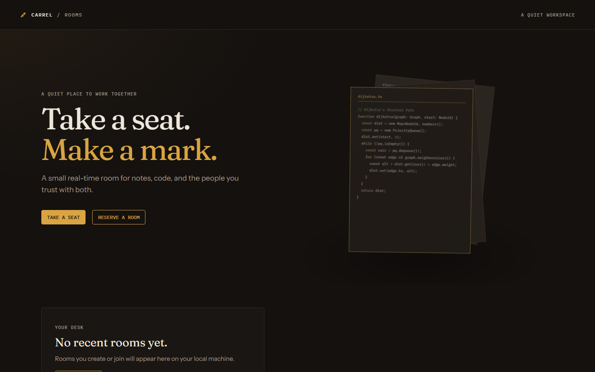
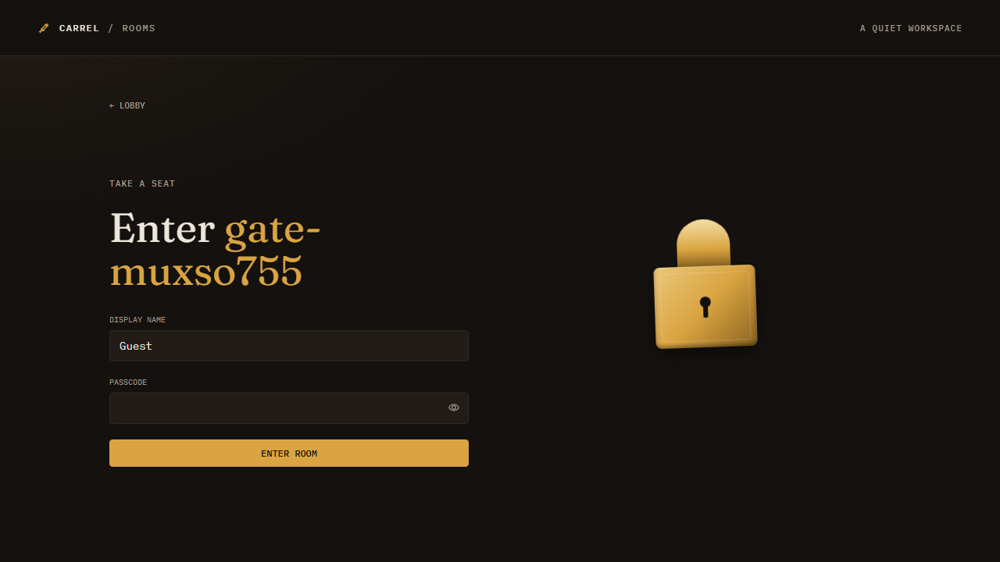
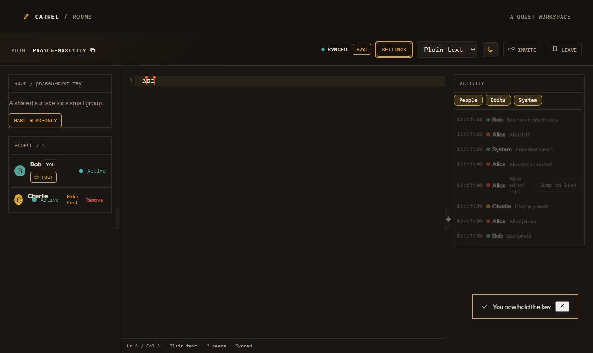

# Carrel

A quiet real-time collaborative workspace for code, notes, and the people you trust with both.

---

## Architecture Overview

Carrel is structured as a monorepo with three workspace packages:

- **`@carrel/shared`**: Common domain schemas, protocol framing constants, close codes, language definitions, and validators.
- **`@carrel/server`**: High-performance Fastify backend with SQLite (`better-sqlite3`), ticket-based HMAC authentication, rate limiting, and raw WebSocket binary multiplexing over Yjs.
- **`@carrel/client`**: Vite + React single-page app with CodeMirror 6, custom syntax themes (Dark and Paper), remote colored selections and carets with 80ms lerp, gutter line highlighting, and presence tracking.

```mermaid
flowchart TD
    subgraph ClientWorkspace["Client Workspace (Vite + React)"]
        UI["React Workspace UI"]
        CM["CodeMirror 6 Editor"]
        CP["CarrelProvider (WebSocket Client)"]
        Presence["Presence & Awareness Hooks"]
        UI --> CP
        CM --> CP
        Presence --> CP
    end

    subgraph ServerWorkspace["Server Workspace (Fastify + WS)"]
        FastifyServer["Fastify HTTP Server"]
        WSServer["WebSocket Server (/ws)"]
        YDoc["In-Memory Y.Doc per Room"]
        DB[(better-sqlite3 WAL Database)]
        Limiter["Crypto Concurrency Limiter (4)"]

        FastifyServer -->|Issue Ticket / Auth| DB
        FastifyServer -->|scrypt Async| Limiter
        WSServer -->|Validate Ticket| FastifyServer
        WSServer -->|Sync & Awareness| YDoc
        YDoc -->|Snapshots (Debounced)| DB
    end

    CP <==>|Binary WebSocket (Frames 0, 1, 2)| WSServer
    UI <==>|REST API (/api/rooms)| FastifyServer
```

---

## Features

- **CRDT Document Synchronization**: Real-time collaborative editing using Yjs CRDTs with strictly framed delta updates.
- **Framing & Multiplexing**: Single WebSocket connection multiplexes:
  - `0`: Yjs synchronization frames
  - `1`: Yjs awareness updates (presence, selection, carets, line highlights)
  - `2`: Application control messages (JSON)
- **Presence & Remote Carets**:
  - Live participant roster with role badges (`HOST` vs `MEMBER`).
  - Remote selections and carets with smooth 80ms lerp animation (disabled when `prefers-reduced-motion` is active).
  - Multi-state user presence tracking: `Typing` (reverts after 1500ms), `Active`, `Idle` (triggers after 60s inactivity), and `Away` (on document hidden).
  - Awareness frame coalescing to eliminate redundant re-renders.
- **Gutter Line Highlighting**:
  - Click gutter line numbers to broadcast temporary highlights across peers.
  - Pin highlights with double-click or shift-click for line ranges; unpinned highlights fade after 6 seconds.
- **Editorial Design System**:
  - Dual themes: **Dark** and **Paper** (light).
  - Bespoke typography using _Instrument Sans_, _Fraunces_, and _IBM Plex Mono_.
  - Handcrafted syntax tokens: Brass (keywords), Verdigris (strings), Ochre (numbers), Muted (comments), and Madder (errors/invalid).
- **Hardened Security**:
  - Nonce-based single-use HMAC tickets (`TICKET_TTL_MS`).
  - Non-blocking asynchronous scrypt hashing with a strict concurrency limit of 4.
  - Reverse proxy IP handling (`TRUST_PROXY`) avoiding spoofed `X-Forwarded-For` brute-force bypasses.
  - Exponential / progressive lockout rate limiting on incorrect room passcodes.
  - 10-minute lockout on kicked members (`CLOSE_CODE` 4003).
  - Maximum document size enforcement (`MAX_DOC_BYTES`) rejecting oversized updates without terminating sockets.
  - Creator key authentication ensuring host status is strictly authorized.

---

## Host and Roles

Carrel implements a resilient, deterministic host election and role management system designed for collaborative stability. The room host possesses administrative powers over room configuration and access, while automated state machines govern succession during network disconnects.

### Rules of Succession and Administration

1. **Host Grace Window (`HOST_GRACE_MS`)**: When a host disconnects, their seat is not immediately forfeited. The server starts a grace timer (default `5000ms`, `1500ms` in testing) and marks the room in a grace state (`hostPending`). Connected peers observe a "Host away" indicator, while administrative actions are disabled to prevent state conflicts during transient connection drops.
2. **Reconnection Within Grace**: If the disconnected host reconnects before the grace timer expires, their socket re-attaches to their existing membership. The grace timer is cancelled immediately, host status is preserved without interruption, and no `host_changed` audit event is emitted.
3. **Grace Expiry and Seniority Election**: If the grace timer fires without the host returning, the server evicts the ex-host and conducts an automated election among all connected members. Promotion is strictly seniority-based: the member with the earliest connection timestamp (`min(joinedAt)`) is promoted. In the rare case of simultaneous join times, the tie is broken deterministically by lower lexicographical `clientId`.
4. **Demotion on Return**: An ex-host reconnecting after their grace window has elapsed is admitted as a regular `member` if the room already has an active host. They reclaim host status only if the room became headless in the interim.
5. **Seniority Preservation Window (`SENIORITY_WINDOW_MS`)**: When any member disconnects and reconnects within a 30-second window, their original `joinedAt` timestamp and preferred participant color are restored from the `recentlyLeft` map. Temporary network flickers or tab refreshes do not penalize a member's standing in subsequent host elections.
6. **Headless Rooms and Promotion Policy**:
   - **Empty Room**: If all participants disconnect, the room enters a dormant headless state. Document snapshots remain safely stored in SQLite.
   - **Creator Return**: When the original room creator reconnects to an empty room, creator key verification restores their host status immediately.
   - **Deliberate Headless-Occupied Promotion**: If an occupied room becomes headless (e.g., creator disconnects when alone, grace expires, and peers join), the server immediately executes a `vacant` election to promote the most senior occupant. An occupied workspace is never left indefinitely leaderless.
7. **Duplicate Client Replacement (Code 4000)**: When a client connects using a `clientId` that is already active in the room, the older WebSocket is closed with code `4000` (`replaced`). Buffered updates are flushed, and connection state is transferred without removing the member or resetting seniority.
8. **Atomic Host Handover (`make_host`)**: The active host can deliberately delegate leadership to any connected member. The handover executes atomically: roles are swapped, a `role_changed` control message with `reason: 'handover'` is broadcast, and an audit entry is logged.
9. **Host Administrative Powers**:
   - **Passcode Management (`set_passcode`, `remove_passcode`)**: Host can configure or revoke room passcodes using asynchronous scrypt hashing with per-room random salts.
   - **Room Locking (`set_locked`)**: Host can lock the room, rejecting new non-credentialed connections with code `4008`.
   - **Read-Only Mode (`set_readonly`)**: Host can toggle read-only mode, restricting document edits across all non-host participants.
   - **Language Selection (`set_language`)**: Host can switch the active syntax highlighting language for all peers.
   - **Member Removal (`kick`)**: Host can eject any member with code `4003`, enforcing an automatic 10-minute lockout on the member's `clientId`.

---

## Protocol Summary

### Frame Types (Binary WebSocket)

All WebSocket payloads begin with a 1-byte header declaring the frame type:

| Frame Byte | Name              | Description                                                                                                                                                         |
| :--------: | :---------------- | :------------------------------------------------------------------------------------------------------------------------------------------------------------------ |
|    `0`     | `FRAME_SYNC`      | Raw Yjs sync message (`y-protocols/sync`). Encodes `syncStep1`, `syncStep2`, or document updates.                                                                   |
|    `1`     | `FRAME_AWARENESS` | Raw Yjs awareness update (`y-protocols/awareness`). Propagates cursor position, text selections, and line highlights.                                               |
|    `2`     | `FRAME_CONTROL`   | UTF-8 JSON payload for application orchestration (`roster`, `audit`, `room_updated`, `kick`, `make_host`, `set_language`, `set_readonly`, `ping`, `pong`, `error`). |

### WebSocket Close Codes

|  Code  | Name              | Reason                                                                                     |
| :----: | :---------------- | :----------------------------------------------------------------------------------------- |
| `4001` | `badTicket`       | Ticket missing, expired, signature invalid, or nonce already consumed.                     |
| `4003` | `kicked`          | Member was kicked by room host; barred from rejoining for 10 minutes.                      |
| `4008` | `roomLocked`      | Room is locked and joining client does not hold an admitted ticket or creator credentials. |
| `4009` | `roomFull`        | Room has reached maximum allowed concurrent peers (`MAX_PEERS_PER_ROOM`).                  |
| `1008` | `policyViolation` | Generic policy violation or malformed payload.                                             |

---

## Environment Variables

| Variable             |   Type    |          Default          | Description                                                                           |
| :------------------- | :-------: | :-----------------------: | :------------------------------------------------------------------------------------ |
| `PORT`               | `number`  |          `3001`           | HTTP and WebSocket server listening port.                                             |
| `CLIENT_ORIGIN`      | `string`  |  `http://localhost:4173`  | Allowed CORS origin for browser client requests.                                      |
| `DATABASE_PATH`      | `string`  |    `./data/carrel.db`     | Path to SQLite database file. Parent directory is created automatically.              |
| `SESSION_SECRET`     | `string`  | _Required_ (min 32 chars) | Secret key used to sign HMAC tickets and session tokens. Must never be committed.     |
| `HOST_GRACE_MS`      | `number`  |          `5000`           | Grace window in milliseconds before host privileges are reassigned on disconnect.     |
| `MAX_DOC_BYTES`      | `number`  |      `1048576` (1MB)      | Maximum document size in bytes allowed before updates are rejected.                   |
| `MAX_PEERS_PER_ROOM` | `number`  |            `7`            | Maximum number of concurrent connected clients permitted per room.                    |
| `TICKET_TTL_MS`      | `number`  |       `60000` (60s)       | Lifespan of one-time ticket tokens used during WebSocket upgrade.                     |
| `SESSION_TTL_MS`     | `number`  |     `86400000` (24h)      | Lifespan of client session tokens.                                                    |
| `TRUST_PROXY`        | `boolean` |          `false`          | When `true`, enables Fastify `trustProxy` to resolve `req.ip` behind reverse proxies. |

See `server/.env.example` for a ready-to-use template.

---

## Prerequisites

- **Node.js**: >=20.0.0 (engines: `node: ">=20.0.0"` in package.json, verified on Node.js v20 and v22 LTS)
- **npm**: v10+

---

## Visual Interface & Verified Screenshots

Four verified production screens saved directly in `docs/`:

| 3-User Workspace (Three contexts, Carets, HOST badge, Typing status) | Lobby (Three.js Desk Lamp & Card) |
| :------------------------------------------------------------------: | :-------------------------------: |
|                         |           |

| Passcode Gate (Padlock & Entrance Flap) |      Live Activity Feed (Post Host Promotion)       |
| :-------------------------------------: | :-------------------------------------------------: |
|          |  |

---

## Installation & Setup

```bash
# Clean install of all workspace dependencies
npm ci

# Build shared types, client bundle, and server
npm run build
```

---

## Running the Application

### Option A: Run Server and Client Concurrently

```bash
# Starts client on port 4173 and server on port 3001
SESSION_SECRET="your-32-character-secret-key-goes-here-12345" npm run dev:all
```

### Option B: Run Workspaces Independently

```bash
# Terminal 1: Server
cd server
SESSION_SECRET="your-32-character-secret-key-goes-here-12345" npm run dev

# Terminal 2: Client
cd client
npm run dev
```

The web client will be available at `http://localhost:4173` and the server at `http://localhost:3001`.

---

## Multi-Tab Testing Guide

1. Open `http://localhost:4173` in Browser Window A.
2. Click **Reserve a Room**, enter a Room ID (e.g. `quiet-study`), set an optional passcode, enter your display name (`Alice`), and submit.
3. Observe the top-bar shows **`HOST`** badge and connection status reads **`Synced`**.
4. Open an Incognito Window or separate browser (Browser Window B) and navigate to `http://localhost:4173/join/quiet-study`.
5. Enter display name (`Bob`), provide the passcode, and enter the room.
6. Verify:
   - Window A and Window B both list each other in the participant roster.
   - Typing in Window A immediately renders remote colored carets and selections in Window B.
   - Clicking line numbers in Window A gutter highlights the corresponding line in Window B with a warm indicator.
   - Activity feed reflects audit events using member display names instead of raw IDs.

---

## Testing & Verification

```bash
# Run unit and integration tests across all workspaces (zero skipped tests)
npm test

# Run Playwright dual-client end-to-end test (with screenshot capture)
npm run test:e2e

# Run linter and formatting checks
npm run lint

# Format codebase with Prettier
npm run format
```

All 110 unit and integration tests run with **0 skipped tests**:

- 78 server security, convergence, rate limiting, host election, Phase 5 state machine, and fuzz tests.
- 27 client UI, presence timers, awareness coalescing, ActivityFeed windowing and filtering, RoomSettingsModal, and host crown tests.
- 5 shared protocol framing, Phase 3, and Phase 5 schema and validator tests.

Playwright E2E suite verifies dual-client editing, offline merges, throttle resilience, server restart, and 3-context host succession after grace period.

---

## Deploying Carrel

Carrel deploys as a **single, unified service** on Fly.io (or any Docker container host). Fastify serves the built client SPA, the REST API, and WebSockets on a single origin, with SQLite on a mounted persistent volume.

### Fly.io Deployment Steps

```bash
# 1. Initialize Fly application (do not deploy yet)
fly launch --no-deploy

# 2. Create a persistent volume for SQLite (1 GB is ample for WAL snapshots)
fly volumes create carrel_data --size 1 --region iad

# 3. Set the required production session secret (must be >= 32 characters)
fly secrets set SESSION_SECRET=$(openssl rand -hex 32)

# 4. Deploy the single-service container
fly deploy
```

### Production Environment Variables

| Variable                |                       Default                        | Purpose / Production Guidance                                                                                                                                                |
| :---------------------- | :--------------------------------------------------: | :--------------------------------------------------------------------------------------------------------------------------------------------------------------------------- |
| `PORT`                  |            `3001` (local) / `8080` (Fly)             | Listening port for Fastify HTTP and WebSocket server.                                                                                                                        |
| `SESSION_SECRET`        |                        _None_                        | **Required (>=32 chars)**. Cryptographic HMAC secret for tickets & sessions. Process fails fast on boot if missing or <32 chars.                                             |
| `DATABASE_PATH`         | `./data/carrel.db` (local) / `/data/carrel.db` (Fly) | Path to SQLite database. Must reside on a mounted persistent volume in production.                                                                                           |
| `TRUST_PROXY`           |            `false` (local) / `true` (Fly)            | Reverse proxy trust for Fastify IP resolution. **Must ONLY be enabled behind a trusted proxy** (e.g., Fly.io, Cloudflare) to prevent spoofed `X-Forwarded-For` abuse bypass. |
| `ROOMS_PER_IP_PER_HOUR` |                         `10`                         | Maximum room creations per IP address per hour. Exceeding requests receive `429` (`rate_limited`).                                                                           |
| `MAX_ROOMS`             |                        `500`                         | Global capacity cap on created rooms stored in SQLite. Exceeding creations receive `429` (`rate_limited`).                                                                   |
| `IDLE_ROOM_EVICT_MS`    |                    `600000` (10m)                    | Duration of 0 connected members after which in-memory `Y.Doc` and awareness states are saved to SQLite and freed from RAM. Subsequent connections automatically rehydrate.   |
| `ENABLE_TEST_ENDPOINTS` |                       `false`                        | Gate for destructive test endpoints (`POST /api/test/restart`). Must remain `false` in production.                                                                           |
| `HOST_GRACE_MS`         |                        `5000`                        | Milliseconds granted to a disconnected host before an automated seniority election runs.                                                                                     |
| `SENIORITY_WINDOW_MS`   |                       `30000`                        | Window during which disconnected members retain their join timestamp and participant color upon reconnecting.                                                                |
| `KICK_BAN_MS`           |                    `600000` (10m)                    | Lockout duration enforcing that kicked members cannot rejoin the room.                                                                                                       |
| `MAX_DOC_BYTES`         |                   `1048576` (1MB)                    | Maximum binary size of a document update payload.                                                                                                                            |
| `MAX_PEERS_PER_ROOM`    |                         `7`                          | Maximum simultaneous connected peers allowed in a room.                                                                                                                      |

### Why Carrel Runs as a Single Instance

Carrel coordinates document synchronization using **in-memory Yjs CRDTs** and live binary WebSockets with ephemeral awareness states. In a distributed multi-instance deployment without a dedicated pub/sub message broker (such as Redis or Dragonfly), users connecting to different container instances would be isolated and unable to collaborate.

By running Carrel as a single dedicated instance:

- All room peers connect to the exact same in-memory `Y.Doc` and awareness session.
- Document snapshots are periodically and gracefully flushed to a mounted persistent SQLite volume with Write-Ahead Logging (`WAL`).
- `fly.toml` sets `min_machines_running = 1` and `auto_stop_machines = false` so the instance does not hibernate while rooms are active.
- Idle rooms with no active members are evicted from RAM after 10 minutes (`IDLE_ROOM_EVICT_MS`), saving their snapshot and freeing heap memory until rehydrated.

### Post-Deployment Smoke-Test Checklist

Verify your production deployment with these quick steps:

- [ ] **Health Check**: Run `curl -f https://<app-name>.fly.dev/api/health` and verify `{"ok":true,"service":"carrel-server"}`.
- [ ] **SPA Client Delivery**: Run `curl -i https://<app-name>.fly.dev/` and check HTTP 200 with `Cache-Control: no-cache, no-store, must-revalidate`.
- [ ] **Immutable Assets**: Verify static JS/CSS assets under `/assets/` return `Cache-Control: public, max-age=31536000, immutable`.
- [ ] **SPA Route Fallback**: Open direct URL `https://<app-name>.fly.dev/r/test-room` in a browser; verify the page loads the Carrel app instead of a 404 error.
- [ ] **Room Creation & Editing**: Create a room, write text, and observe real-time character convergence.
- [ ] **Multi-Peer Sync**: Open the same room link in an incognito window, observe live remote carets, selection highlights, and chat/audit events.
- [ ] **Graceful Restart & Persistence**: Run `fly apps restart <app-name>`, wait for health check recovery, refresh the browser, and confirm room text and settings remain fully intact.

---

## Security Architecture

- **Single-Use HMAC Tickets**: WebSocket upgrades require a signed ticket with an embedded nonce and expiration timestamp. Nonces are recorded on use, preventing replay attacks.
- **Passcode Brute-Force Defense**: Failed passcode attempts trigger progressive lockouts tracked by client IP (using `req.ip` with `TRUST_PROXY` validation). Rotating headers such as `X-Forwarded-For` cannot bypass rate limits.
- **Non-Blocking Cryptography**: Passcode hashing utilizes asynchronous `crypto.scrypt` wrapped with a strict `ConcurrencyLimiter(4)` to prevent event loop exhaustion under concurrent requests.
- **Document Payload Capping**: Inbound updates are evaluated against `MAX_DOC_BYTES` on a scratch doc prior to state modification; violating updates are discarded with an error message while preserving the connection.
- **Audit Log Redaction**: Fastify logging redacts sensitive parameters (`passcode`, `ticket`, `sessionToken`, `creatorKey`) in HTTP headers, request bodies, and responses.

---

---

## Load Testing & Real Measured Numbers

Execute the comprehensive multi-scenario load test harness:

```bash
npm run loadtest
```

The load test simulates aggressive concurrent clients, high-frequency edit bursts, sustained flooding, and awareness floods while observing event loop delays and convergence.

### Real Measured Benchmark Numbers

| Scenario                               | P95 Latency | Max Frames/s | P99 Event Loop Delay |   Status   | Real Measured Metric                                                                         |
| :------------------------------------- | :---------: | :----------: | :------------------: | :--------: | :------------------------------------------------------------------------------------------- |
| **S0 Baseline**                        |    4 ms     |     N/A      |       34.6 ms        | **PASSED** | Zero drops, stable baseline event loop                                                       |
| **S1 Burst**                           |    11 ms    |    6 fps     |       36.34 ms       | **PASSED** | 1,000 / 1,000 characters converged across peers                                              |
| **S2 Sustained (200 updates/s)**       |      —      |      —       |          —           | **PASSED** | Warned at 3.01s, disconnected at 10.06s (Code 1008), 5s cooldown, doc length 1,700 converged |
| **S3 Awareness Flood (500 updates/s)** |      —      |    10 fps    |          —           | **PASSED** | 2,500 sent -> 56 received (lossy rate-limit), final seq 2,499 confirmed                      |

---

## Reconnection & Failure-Mode Notes

1. **Host Grace Window (`HOST_GRACE_MS`)**:
   - When a host socket closes, peers see a **Host away** badge, and administrative controls (settings, lock, readonly) are temporarily disabled.
   - If the host reconnects within the grace window (default 5000ms, 1500ms in tests), host status is seamlessly retained without an election or audit noise.
   - If grace expires, the ex-host is removed from active membership, and an automated seniority election promotes the oldest connected peer.
2. **Offline Editing & Resilient Merge**:
   - When network drops, a persistent banner appears: `"Connection lost. Your edits are safe."`
   - Local edits are buffered in memory and indexed storage.
   - Upon network restoration, the client issues a clean Yjs sync handshake, merging offline edits with remote updates without document divergence or data loss.
3. **Mid-Session Server Restart**:
   - If the server restarts (or sends close code 1001), connected clients do not crash or reload the page.
   - Clients retry with exponential backoff and jitter, re-acquiring tickets and resuming collaboration cleanly.
4. **Rate Limiting & Client Throttling**:
   - Clients sending >200 updates/s receive a `throttle_notice` control frame and visual indicator.
   - Sustained policy violations trigger disconnection with code `1008` (`policyViolation`) and a 5-second cooldown timer.

---

## Design Decisions

### Why Yjs (vs. Operational Transformation)?

- **Decentralized Convergence**: Yjs uses Conflict-free Replicated Data Types (CRDTs) where operations are mathematically commutative. Unlike Operational Transformation (OT), Yjs requires no centralized sequencing authority or complex n-way transformation matrix.
- **State Vector Delta Encoding**: Yjs sync steps exchange concise state vectors (syncStep1 / syncStep2), transferring only missing byte deltas rather than complete document histories.
- **Rich Ecosystem & CodeMirror Binding**: `y-codemirror.next` directly maps CRDT operations to CodeMirror 6 transactions, providing native remote carets and undo/redo stacks.

### Why Lossless Server-Side Frame Throttling?

- **Text Integrity**: Ephemeral signals (mouse positions, presence, typing indicators) are safely throttled with lossy latest-wins sampling (capped at ~12 fps). In contrast, document synchronization frames represent durable intent and must never be dropped.
- **Lossless Queueing**: Server-side sync throttling buffers and coalesces binary updates per client origin, draining them within budget to prevent event loop starvation while ensuring 100% text convergence.

---

## Troubleshooting

- **Port Conflict (3001 or 4173 in use)**:
  - If another process holds the port, inspect using PowerShell `Get-NetTCPConnection -LocalPort 3001, 4173` and terminate the holding PID.
- **Missing `SESSION_SECRET`**:
  - The server strictly enforces a 32+ character `SESSION_SECRET` on boot. Pass it inline or create `.env` from `server/.env.example`.
- **Passcode Lockout**:
  - Exceeding 5 failed passcode attempts initiates a progressive lockout (1m, 2m, etc.) tied to the client IP. Wait for the countdown or restart the server in development.

---

## Known Limitations

- **Single Server / In-Memory Coordination**: Rooms are coordinated in memory on a single process instance with SQLite write-ahead logging (WAL). Horizontal scaling across a cluster would require a distributed pub/sub layer (e.g. Redis or Dragonfly) for awareness and sync broadcasting.
- **History Compaction**: Document history is currently compacted debounced into SQLite snapshots. High-frequency long-lived rooms will benefit from scheduled snapshot truncation or vacuuming.
